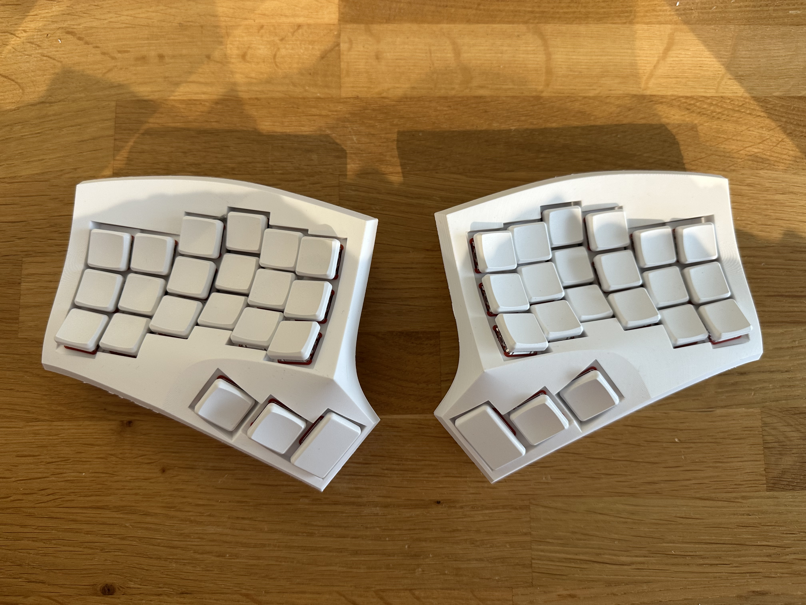

### Cygnus Choc

This is a simple port of the Cygnus keyboard to work with kailh choc switches.

### Preview



### Build instructions
1. Download the 3d files out of ```/files``` and print them yourself or have them printed by service    
2. From that point on I would encourage you to just follow jahukaup's [guide](https://github.com/juhakaup/keyboards/tree/main/Cygnus%20v1.0) as it is much more comprehensive.
3. This model does not use screws to fix the pcbs in place, since the case is quite thin where the switches attach. I would first test that everything works electrically and glue them in place with hot glue afterwards.
4. For wiring, you can check out the [repo](https://github.com/vuoz/cygnus-xiao-ble) I mentioned to make sure to get the wiring correct
5. Fork this repo, wait for the github actions to finish and download & flash to firmware to the controllers. ( This repo only contains firmware for dongle based setup. If you want a standalone with left as central you can go to the [main](https://github.com/vuoz/cygnus-xiao-ble) branch on my other repo and take that firmware)

Most of the build guide for a [zmk](https://zmk.dev/) based cygnus can be found in my other [repo](https://github.com/vuoz/cygnus-xiao-ble), which outlines the process of building a cygnus (mx) with the Seeed Studio XIAO nRF52840 as the controller 

### Notes for printing the files yourself (FDM).
- I have tried other orientations but horizontally prints the most consistent
- Make sure to print with the smallest layer height 
- if you want it extra smooth you could use a 0.2 nozzle but that does increase the print time significantly
- Print with 100% infill

### Futher Notes
- Normal choc keycaps are too wide, try to use ones that have a smaller profile, like the [KLP Lame Keycaps](https://github.com/braindefender/KLP-Lame-Keycaps)
- The housing is quite hollow so using loud, tactile switches does not really lead to a nice sound profile. I would advise to go with silent switches like the [Ambients Silent Choc Switches](https://keycapsss.com/Ambients-Silent-Choc-Switches-LowproKB-Kailh-Choc-V1/KC10221-NOC)

### Credits
- Huge thanks to the original creator of the cygnus [jahukaup](https://github.com/juhakaup/keyboards/tree/main/Cygnus%20v1.0) without his design I would not have been able to remix it.

